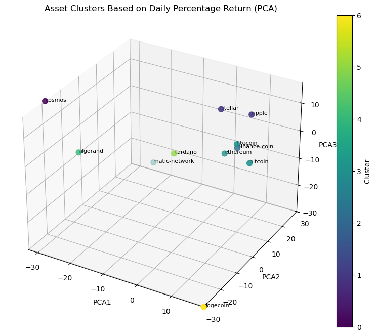

# Correlation Analysis and Clustering of Crypto Assets

This Python project conducts an in-depth analysis of the correlation and clustering between the daily returns of various cryptocurrency assets. The goal is to identify which assets move in tandem in the market, which is crucial for adequate portfolio diversification and risk management.

The analysis enables investors to understand how the prices of different cryptocurrencies relate to one another, utilizing a statistical technique that measures the relationship between their price movements.

## Key Features
1. Data Processing  
	- Automatic detection of execution environment (Colab vs local)
	- Data loading and cleaning
	- Calculation of daily returns (1-day and 30-day periods)
	- Handling of missing values

2. Visualization
	- Price trends over time (linear and logarithmic scales)
	- Return variation plots for both time windows
	- Cluster visualization in 2D and 3D spaces

3. Clustering Analysis
	- K-means clustering for grouping similar assets
	- Silhouette Score evaluation for cluster quality
	- Gap Statistic method for optimal cluster determination
	- Principal Component Analysis (PCA) for dimensionality reduction

## Applications
- Portfolio Diversification: Identify non-correlated assets for risk management
- Market Analysis: Understand grouping behavior of cryptocurrencies
- Investment Strategy: Make informed decisions based on asset correlation patterns

## Quick Run
- Click the "Open in Colab" badge above
- Upload the data to the /content/data/ folder
- Run all the cells in the notebook